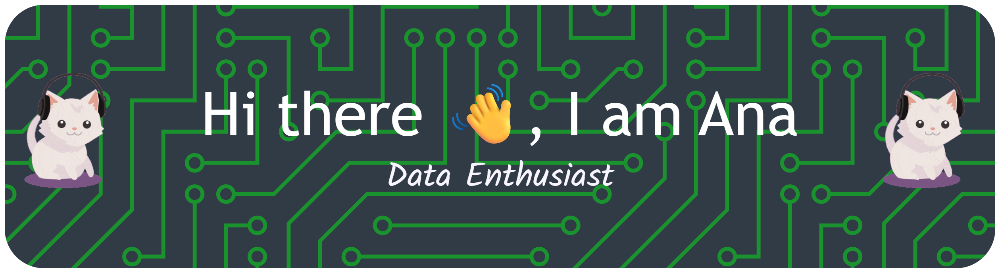

⚡I’m a career switcher who spent my career break learning new skills in data fields. Now I’m diving into **Data Engineering**

👯 **I’m looking to collaborate on data related projects** that involve data cleaning, transformation, and building ETL pipelines.

##### **Skill:**

##### **Connect with me:** 
 

