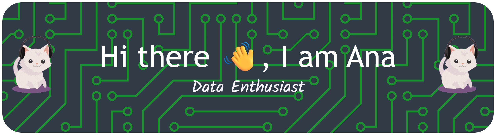

#### A career switcher with 6+ years in hazardous waste (B3) consulting, now building scalable data systems and pipelines. I combine domain expertise + data engineering skills to create real-world, impactful data solutions.
 

---

## About Me
- 6 years as an Environmental Consultant specializing in hazardous & toxic waste (B3)
- Transitioning into Data Engineering with hands-on, project-based learning
- Passionate about building end-to-end data pipelines & platforms
- Continuously learning modern data stack & cloud technologies
- Based in Indonesia
- Strong believer in data-driven solutions powered by domain knowledge
 

---

## Skills & Tools
- **Databases:** PostgreSQL, BigQuery, DuckDB, Lakebase
- **Programming:** SQL, Python
- **Data Engineering & Data Platforms:** dbt, dlt, Apache Spark, PySpark, Kestra, Great Expectations, Bruin
- **AI & Data Applications:** Vector Search, RAG, MCP, AI Agents, Databricks Apps
- **Cloud & Infrastructure:** Databricks, Google Cloud Platform, Docker, Terraform
- **Analytics & Visualization:** Metabase, Looker Studio
- **Version Control:** Git, GitHub

---

## Projects & Portfolio

### jobhunt-ai-agent | AI-Powered Job Hunting Copilot| DataExpert.io Capstone Project
🔗<a href="https://github.com/ananurkaromah/agentic-job-search">Repo</a>

**Tech Stack:** Python, Databricks, Lakebase, Vector Search, RAG, AI Agents, REST API, Databricks Apps.
**Highlights:**
- Built an AI-powered job hunting application combining structured and unstructured data retrieval with agentic workflows.
- Designed a Lakehouse-based architecture using Lakebase for relational application data and vector search for semantic retrieval.
- Implemented RAG-based job matching to connect job requirements with candidate skills and experience.
- Developed AI agent tools for job discovery, matching, and application management through REST APIs.
- Built and deployed the application as a Databricks App, integrating data, retrieval, and AI agent components into a unified workflow.
- Applied context engineering and tool-based agent design to provide grounded, actionable job-search recommendations

---

### estate-pipe | UK Real Estate ELT Pipeline 
🔗 <a href="https://github.com/ananurkaromah/estate-pipe">Repo</a>

**Tech Stack:** Python, PostgreSQL, PySpark, Kestra, Docker, Great Expectations, Metabase.
**Highlights:**
- Built a containerized ELT pipeline processing over 90,000 monthly UK property transactions.
- Designed PostgreSQL schemas and developed automated ingestion workflows using Python and dlt.
- Implemented incremental loading, idempotent transformations, and scalable data processing workflows using PySpark.
- Integrated automated data quality testing using Great Expectations.
- Orchestrated workflows with Kestra and Docker.
- Delivered analytics dashboards for property pricing and geographic trend analysis.

---
### suara-pipeline | Indonesian Regional Speech Intelligence Pipeline | DataTalksClub Capstone Project
🔗 <a href="https://github.com/ananurkaromah/suara-pipeline">Repo</a>

**Tech Stack:** Python, BigQuery, GCS, Terraform, Docker, Bruin, Looker Studio
**Highlights:**
- Built a cloud-native data platform processing 10GB+ of Indonesian regional speech data.
- Automated ingestion from Kaggle API into Google Cloud Storage and BigQuery.
- Developed incremental ingestion and transformation workflows.
- Integrated AI-powered transcription using Faster-Whisper models.
- Managed infrastructure provisioning using Terraform.
- Delivered analytics-ready datasets and dashboards using BigQuery and Looker Studio.
  
---
### NYC Taxi-pipeline (GitHub Repo) | DataTalksClub Homework Project
🔗 <a href="https://github.com/ananurkaromah/nyc-taxi-data-pipeline-with-dlt">Repo</a>

**Tech Stack:** Python, DuckDB, Docker, dlt, Metabase
**Highlights:**
- Built automated ELT workflows for ingesting and analyzing NYC Taxi data.
- Implemented incremental loading patterns and data transformations.
- Created analytics dashboards to support operational insights.
- Managed containerized environments using Docker Compose
---

*Continuously building more real-world data engineering projects...*

---
## Fun & Personal

- I enjoy **learning new technologies and exploring the data ecosystem**
- Problem solver — I enjoy debugging pipelines and solving technical challenges
- Always curious — constantly learning something new in **data engineering**

---

Open to Data Engineering Internships & Opportunities

## Connect with Me

- <a href="https://linkedin.com/in/ananurkaromah">LinkedIn</a>
- <a href="https://discord.com/users/1462129586459644118">Discord</a>
